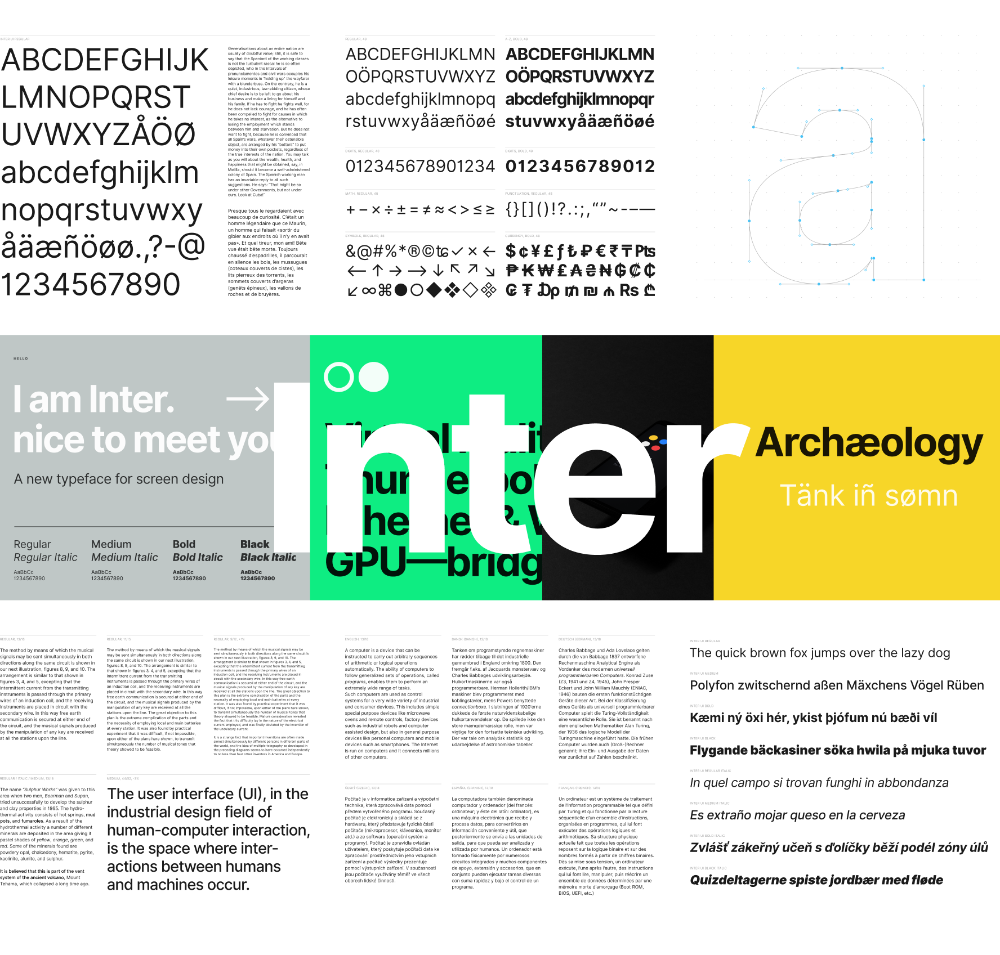
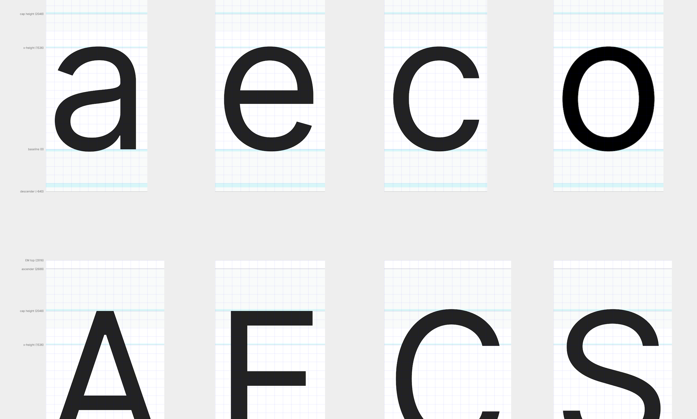
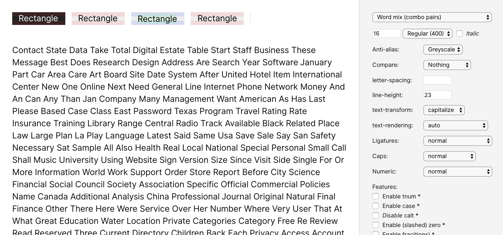

# Interface

Interface is a typeface specially designed for user interfaces, with excellent ligibility at small sizes.



### [⬇︎ Download the latest release](https://github.com/rsms/interface/releases)

After downloading the zip from above:

1. Double-click the downloaded zip file to unpack or open it.
2. Follow the instructions in "install-mac.txt" or "install-win.txt", depending
   on what operating system you're using.


## Design

Interface is similar to Roboto, San Francisco, Akkurat, Asap, Lucida Grande and other "UI" typefaces. Some trade-offs were made in order to make this typeface work really well at small sizes:

- Currently not suitable for very large sizes because of some small-scale glyph optimizations (like "pits" and "traps") that help rasterization at small sizes but stand out and interfere at large sizes.
- Rasterized at sizes below 12px, some stems—like the horizontal center of "E", "F", or vertical center of "m"—are drawn with two semi-opaque pixels instead of one solid. This is because we "prioritize" (optimize for) higher-denisty rasterizations. If we move these stems to an off-center position—so that they can be drawn sharply at e.g. 11px—text will be less legible at higher resolutions.

Current font styles:

- Regular — master
  - Italic
- Bold — master
  - BoldItalic
- Medium — derived from Regular and Bold by mixing
  - MediumItalic
- Black — derived from Regular and Bold by mixing
  - BlackItalic

Future versions will hopefully include lighter weights.


### Font metrics

This font was originally designed to work at a specific size: 11px. Thus, the Units per [EM](https://en.wikipedia.org/wiki/Em_(typography)) (UPM) is defined in such a way that a power-of-two multiple of one EM unit ends up at an integer value compared to a pixel. Most fonts are designed with a UPM of either 1000 or 2048. Because of this we picked a value that is as high as possible but also as close as possible to one of those common values (since it's reasonable to assume that some layout engines and rasterizers are optimized for those value magnitudes.) We ended up picking a UPM of 2816 which equates to exactly 256 units per pixel when rasterized for size 11pt at 1x scale. This also means that when rasterized at power-of-two scales (like 2x and 4x) the number of EM units corresponding to a pixel is an integer (128 units for 2x, 64 for 4x, and so on.)

However, as the project progressed and the typeface was put into use, it quickly
bacame clear that for anything longer than a short word, it was actually hard to
read the almost monotonically-spaced letters.

A second major revision was create where the previously-strict rule of geometry being even multiples of 256 was relaxed and now the rule is "try to stick with 128x, if you can't, stick with 64x and if you can't do that either, never go below 16x." This means that Interface is now much more variable in pace than it used to be, making it work better at higher resolutions and work much better in longer text, but losing some contrast and sharpness at small sizes.



The glyphs are designed based on this "plan"; most stems and lines will be positioned at EM units that are even multiples of 128, and in a few cases they are at even multiples of 64 or as low as 16.

Metrics:

- UPM:        2816
- Descender:  -640
- x-height:   1536
- Cap height: 2048
- Ascender:   2688

Translating between EM units and pixels:

- Rasterized at 11px: 1px = 256 units
- Rasterized at 22px: 1px = 128 units
- Rasterized at 44px: 1px =  64 units

There's a Figma workspace for glyphs, with configured metrics: ["Interface glyphs"](https://www.figma.com/file/RtScFU5NETY3j9E0yOmnW4gv/Interface-glyphs)


## Contributing

By contributing work to the Interface font project you agree to have all work
contributed becoming the intellectual property of the Interface font project as
described by [SIL Open Font License, Version 1.1](http://scripts.sil.org/OFL)

### Building

Prerequisites:

- Python 2.7 with pip (you get pip with `brew install python`)
- [virtualenv](https://virtualenv.pypa.io/)

```
$ ./init.sh
```

This will generate makefile support, dependencies required by the toolchain, etc.
At the end, the script prints instructions for how to activate `virtualenv`.
As a convenience, you can also source init.sh to activate virtualenv.

We can now run `make` to build all font files:

```
$ make
```

Or just specific styles:

```
$ make Regular BoldItalic
```

Or all fonts but only TrueType format (no web file formats):

```
$ make all_ttf
```

Or just specific styles and formats:

```
# Regular in all formats, BoldItalic in only TrueType format
$ make Regular BoldItalic_ttf
```

You can also specify specific style + file format to `make` through `build/Interface-STYLE.FORMAT`.
E.g.

- `make build/Interface-MediumItalic.eot`
- `make build/Interface-Bold.woff2`
- `make build/Interface-Regular.ttf`
- `...`

All resulting font files are written to the `build` directory with `Interface-` as the filename prefix.

Note: Making all files takes a considerable amount of time.
It's a CPU and I/O intensive task to compile the fonts and so the build system has been setup to
be able to run many jobs in parallel. Therefore it's recommended to pass the [`-j` flag to make](https://www.gnu.org/software/make/manual/html_node/Parallel.html) and
optionally pipe the fairly verbose output to /dev/null, e.g. `make -j 8 >/dev/null`.


### Editing

This font is stored and authored in the [Unified Font Object (UFO)](http://unifiedfontobject.org/) file format and can be edited by many different software, some free. However, it's only been "tested" with [RoboFont](http://robofont.com/) which is a popular commercial font editor. There's a 30 day fully-functional free trial version of the app, so you can use it for smaller contributions without needing to buy a RoboFont license.

To make life easier for you, configure RoboFont's settings like this:

- Set the grid to 128 units. This means that each grid square equals one pixel at 2x scale.
- Set "Snap points to" to a reasonably high number that's a power-of-two, like 8.
- Set "SHIFT increment" to 16
- Set "CMD SHIFT increment" to 128

When you've made an edit, simply save your changes and run make:

```
$ make
```

*For quick turnaround, consider:*

- Build and test only the "Regular" style.
- Use `misc/notify` to get desktop notifications on builds so that you don't have to sit and wait looking at the terminal while it's building.

E.g. `misc/notify make Regular`

See ["Building"](#Building) for more details.


### Preview & debug

This project comes with a simple web-based application for debugging and
previewing the font. It's a very useful tool to have when working on the font.

- Comes with a large body of sample text data (which is also editable.)
- Provides samples of the most common latin-script pairs, useful for kerning.
- Provides samples of words ordered by commonality in latin scripts with a
  preference for English (accessible via common-pair samples.)
- Can show the complete repertoire of the fonts, with correct glyph order and
  even RoboFont color labels ("marks").
- Controls for basic font properties like family, weight, italic, size,
  line-height, letter-spacing, etc.
- Controls for a lot of font features like ligature sets, contextual alternates,
  alternate numerics, etc.
- Controls for web-browser text features like `captialize`, `uppercase`,
  `lowercase`, etc.
- Ability to compare Interface side-by-side with other fonts.



The following will start a local web server (which is only accessable from your local computer; not the internet) that serves the debug-and-preview app:

```
$ docs/serve.sh &
```

You can now visit `http://localhost:2015/lab/`.
After you rebuild some font files, reload the web page to refresh fonts.


## FAQ

> Do I need RoboFont?

No, you don't. To build font files, all you need is Python. To edit the font files, you need something that can edit UFO files (like [RoboFont](http://robofont.com/) or a text editor.)


> `KeyError: 'Lj'` when building

This probably means that you need to run `./init.sh` to setup the case-sensitive virtual file system mount that is needed by the font build system. Unfortunately the toolchain used (which is the same as for Roboto) requires not only a case-preserving file system, but also a case-sensitive one.


> `ImportError: No module named robofab.objects.objectsRF`

Python virtualenv not configured. Run `. init.sh`


> `make: *** No rule to make target ...`

Run `./init.sh` to update the generated makefile.
